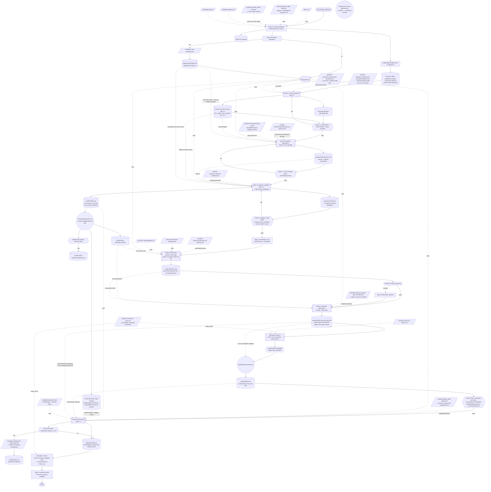
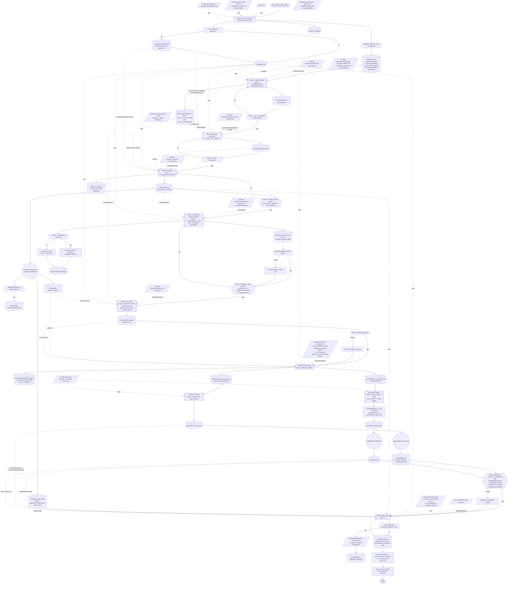
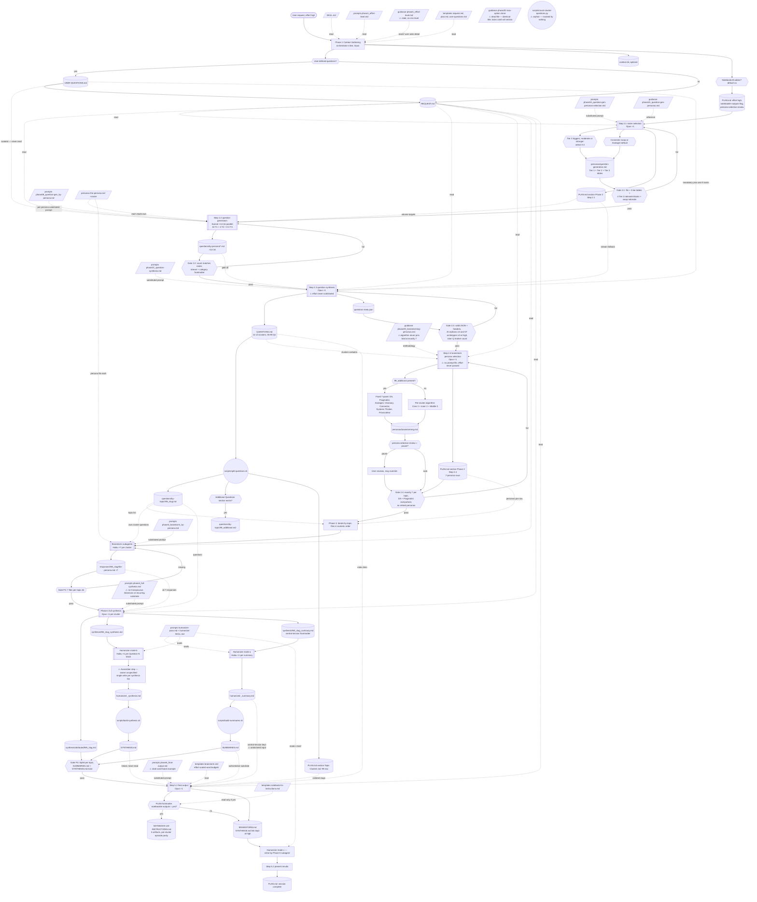

# Idea Symphony — Workflow Flowcharts by Effort Level

One flowchart per effort level, showing every skill file consumed, every session artifact produced, every subagent spawn (model × count), script invocation, quality gate, and conditional branch. Reconciled from four independent dry-run orchestration traces (2026-06-10 pre-1.0 audit) plus a baseline drafted from SKILL.md.

⚠ markers flag points where the spec currently forks or is silent — each corresponds to a finding in [docs/dev/skill-audit-1.0.md](dev/skill-audit-1.0.md). Charts depict the workflow as specified today, not as it should be after fixes.

## Legend

| Shape | Meaning |
|---|---|
| `[/file/]` parallelogram | Skill file read (prompts/, guidance/, templates/, scripts source, personas/) |
| `[(artifact)]` cylinder | Session artifact written/read |
| `{{…}}` hexagon | Quality gate or conditional branch |
| `[[…]]` subroutine | Subagent spawn (model × count) |
| `((…))` circle | Deterministic shell script execution |
| `[…]` rectangle | Orchestrator-inline step |
| dotted edge | Read/consume relationship |
| solid edge | Control flow / produce relationship |

Common to all levels: Phase 1 runs inline in the orchestrator (Opus); every subagent receives substituted `{{vars}}` and reads its own files (the orchestrator passes paths, not contents); every phase updates PLAN.md status.

---

## `min` effort

Self-contained speed run via `prompts/min-effort-workflow.md`. No persona system, no `personas/` directory, no `questions-meta.json`, no Step 2.x statuses, no NotebookLM question.

```mermaid
flowchart TD
    U[User request] --> P1[Phase 1 Context Gathering<br/>orchestrator inline, Opus]
    SK[/SKILL.md/] -.read.-> P1
    EFF[/prompts phase1_effort-level.md<br/>trigger detection/] -.read.-> P1
    GUID[/guidance phase1_effort-level.md<br/>⚠ stale 3-level taxonomy/] -.read if user asks detail.-> P1
    TREQ[/templates request.md/] -.-> P1
    TUQ[/templates user-questions.md/] -.-> P1
    TPLAN[/templates plan.md/] -.-> P1
    P1 --> CTX[(context dir, optional)]
    P1 --> UQGATE{{User questions provided?}}
    UQGATE -- yes --> UQ[(USER-QUESTIONS.md)]
    UQGATE -- no --> REQ
    UQ --> REQ[(REQUEST.md)]
    P1 --> MINBRANCH{{Effort = min:<br/>skip NotebookLM question,<br/>omit notebooklm-outputs field}}
    MINBRANCH --> PLAN[(PLAN.md)]
    PLAN --> MW[Enter min workflow]
    MWF[/prompts min-effort-workflow.md/] -.read.-> MW

    MW --> S1[Step 1 Question Generation]
    S1 --> SP1[[Generic question gen<br/>Sonnet ×1]]
    P2B[/prompts phase2B_question-gen_generic.md<br/>⚠ output path not session-anchored/] -.prompt.-> SP1
    REQ -.read.-> SP1
    UQ -.read if exists — allowed at min only.-> SP1
    SP1 --> QM[(QUESTIONS.md<br/>15-20 Qs, Topic Cluster NN headers)]
    QM --> SQ((scripts/split-questions.sh))
    SQ --> BT[(questions/by-topic/NN_slug.md ×3-5)]
    SQ --> PLANTC[(PLAN.md section<br/>Topic Clusters from Phase 2)]
    BT --> G1{{Gate 1: headers present,<br/>3-5 by-topic files,<br/>User Q marker count}}
    G1 -- fail --> S1
    G1 -- pass --> S2[Step 2 Generic Brainstorming<br/>topics in numeric order]

    S2 --> SP2[[Generic brainstorm<br/>Sonnet ×1 per cluster]]
    P3G[/prompts phase3_brainstorm_generic.md<br/>⚠ output path not session-anchored/] -.prompt.-> SP2
    REQ -.read.-> SP2
    BT -.own cluster only.-> SP2
    SP2 --> RESP[(responses/NN_slug/generic-response.md)]
    RESP --> G2{{Gate 2: one response per topic}}
    G2 -- fail --> S2
    G2 -- pass --> S3[Step 3 Summary Generation]

    S3 --> SP3[[Summary subagents<br/>Sonnet ×1 per cluster]]
    P4M[/prompts phase4_summary-only_min-effort.md<br/>⚠ topic var source unstated/] -.prompt.-> SP3
    RESP -.read.-> SP3
    SP3 --> SUMF[(synthesis/NN_slug_summary.md<br/>central-tension frontmatter)]
    SUMF --> HUM1[[Humanizer mode a<br/>Haiku ×1 per summary, edits in place]]
    HPP[/prompts humanizer-pass.md/] -.prompt.-> HUM1
    HSK[/prompts humanizer SKILL.md/] -.style rules.-> HUM1
    HUM1 --> GV1{{⚠ grep-based verification<br/>procedure unspecified}}
    GV1 --> BS((scripts/build-summaries.sh))
    SUMF -.frontmatter stripped here.-> BS
    BS --> SUMM[(SUMMARIES.md)]
    SUMM --> G3{{Gate 3: 1 summary per topic,<br/>no synthesis or attributed files,<br/>SUMMARIES.md exists}}
    G3 -- fail --> S3
    G3 -- pass --> S4[Step 4 Final Output]

    S4 --> AMB{{⚠ AMBIGUOUS ROUTE:<br/>min Step 4.1 self-contained vs<br/>phase5 prompt claiming all efforts}}
    AMB -- min Step 4.1 --> ORC4[Generate BRAINSTORM.md<br/>Sonnet per min model table<br/>no Central Tensions in content list]
    QM -.read.-> ORC4
    SUMM -.authoritative input.-> ORC4
    TBR[/templates brainstorm.md<br/>⚠ hardcodes model-requested opus/] -.template.-> ORC4
    AMB -- phase5 route --> SP5[[Final output subagent<br/>⚠ model conflict Opus vs Sonnet]]
    P5[/prompts phase5_final-output.md/] -.prompt.-> SP5
    SUMM -.read.-> SP5
    SUMF -.central-tension frontmatter<br/>⚠ forbidden by min Step 4&#46;1 re-read rule.-> SP5
    TBR -.template.-> SP5
    ORC4 --> BRM[(BRAINSTORM.md)]
    SP5 --> BRM
    BRM --> HUM2[Humanizer mode c<br/>inline whole-file pass<br/>⚠ runner ambiguous vs min model table Haiku]
    HPP -.prompt.-> HUM2
    HUM2 --> S42[Step 4.2 Present results]
    S42 --> DONE[(PLAN.md: session complete)]
```

---

## `low` effort

Full Phase 2 question pipeline (Steps 2.1–2.3), Step 2.4 skipped, fixed Devil's Advocate + Pragmatist pair, summary-only Phase 4. No `_synthesis.md`, no `attributed/`, no `SYNTHESIS.md`.

---

## `medium` effort

Full pipeline: Steps 2.1–2.4, 4 brainstorming personas per topic (Core pair + 2 Inner Ring; catch-all cluster gets the fixed 4-panel), full three-output synthesis, both build scripts, both rollup files.

---

## `high` effort

Medium's pipeline at maximum settings: Tier 2 joins question generation (14–16 generators), 7 brainstorming personas per topic (Core 2 + Inner 2 + Middle Ring completers 3; catch-all gets the fixed 7-panel), hard floors scale to ≥3, word budgets scale up.

---

## Reconciliation notes

Where the four traces and the SKILL.md-only baseline disagreed, the traces won (they read every file). Notable resolutions:

1. **`min` does run `split-questions.sh`** and the by-topic/PLAN Topic Clusters machinery — the baseline marked this uncertain.
2. **`min`'s final-output route is a genuine fork**, not a baseline misreading: min Step 4.1 is self-contained while `phase5_final-output.md` claims all effort levels (audit decision B1). The chart shows both branches.
3. **Humanizer mode (c) is run inline by the BRAINSTORM.md-producing agent itself** (phase5:112; min:163), not as a separate Haiku spawn — contradicting the baseline's guess and min's own model table (audit B1/quick fixes).
4. **`count-cluster-questions.py` and `guidance/phase2D_…_max-option.md` are unreachable** from every effort level (audit B9/B10); they appear as disconnected nodes.
5. **Phase 3 at medium/high reads only the PLAN.md Step 2.4 table** (not `personas/brainstorming.md`), but must join it with the Topic Clusters section to get cluster slugs — that join is currently implicit (audit #15/B5).
6. All artifacts listed in SESSION-STRUCTURE.md appear as nodes in the matching chart, plus two artifacts SESSION-STRUCTURE omits (`questions-meta.json`, `NOTEBOOK-LM-INSTRUCTIONS.md`) — audit quick fix #30.
